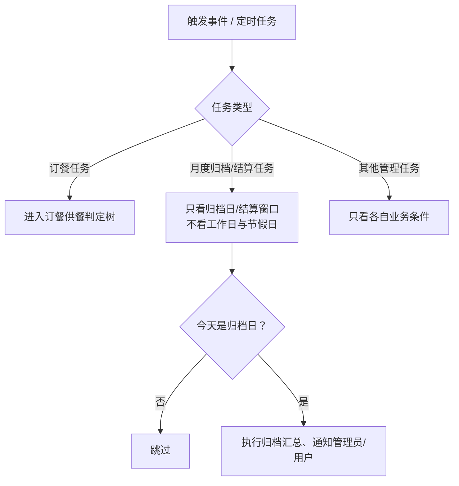
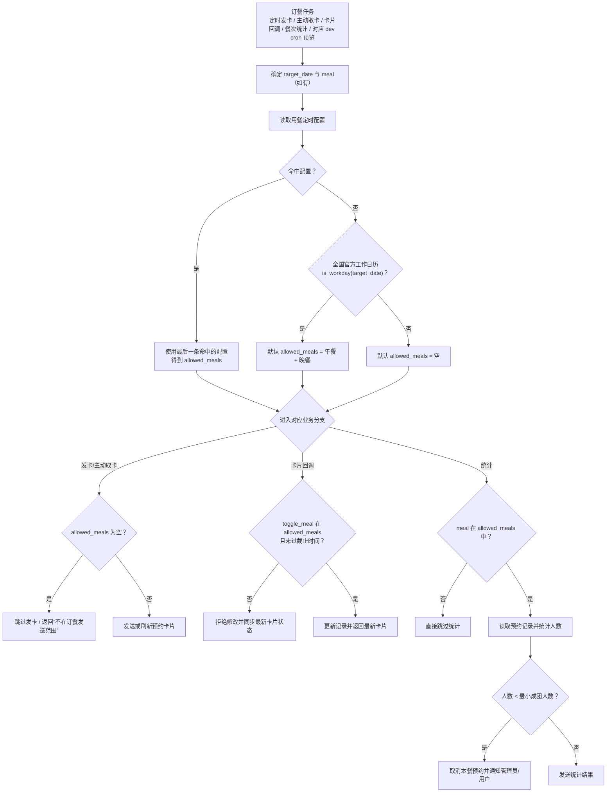

# 食堂预约机器人

## 1. 项目目标
- 基于飞书机器人和飞书多维表格，实现按全国官方工作日历自动发起食堂预约。
- 用户通过消息卡片按钮选择餐次，系统自动写入和更新用餐记录。
- 在每餐预约截止后自动发送统计结果给指定接收人。
- 每月按配置归档日汇总餐费，写入归档表并发送用户/管理员通知。
- 统计发送时间 = 截止时间 + `schedule.send_stat_offset`（支持秒级偏移）。

## 2. 业务范围与约束
- 数据存储：仅使用飞书多维表格，不使用本地数据库。
- 运行方式：Python + uv。
- 网络约束：不依赖固定公网 IP。
- 配置原则：不在配置中固定 field_id，通过字段名动态匹配 field_id，私密配置与共享配置分离（`config.local.toml` / `config.shared.toml`）。

## 3. 业务规则（条理化）
### 3.1 每日预约卡片发送
- 在配置日期内，每天固定时间向启用用户发送预约卡片；`schedule.send_cards_for_next_day=true` 时发送次日预约卡片，`false` 时发送当天预约卡片。
- `schedule.card_request_cutover` 是用户主动取卡的预约窗口切换点：早于该时间返回当天卡片，大于等于该时间返回次日卡片。
- 卡片提供三个按钮：午餐、晚餐、刷新。
- 点击按钮即切换对应餐次的选中状态，并立即回写记录与刷新卡片高亮状态。
- 点击“刷新”会重新读取卡片业务日期对应记录并同步按钮高亮，不会修改表格。
- 对带回调上下文的卡片点击，会先快速返回“处理中”的可视化状态，后台再按最新配置与最新记录完成最终校验和回写。
- 每次点击都会重新读取“用餐定时配置”与“用餐记录”，不信任旧卡片上的历史状态。
- 默认推荐来源于“用餐人员配置”表中的“餐食偏好”。
- 用户给机器人发 `请假` 会收到请假卡片，可选择开始日期和结束日期，暂停该区间内的自动预约。
- 请假提交后会批量预写该用户在区间内各日期的“用餐记录”，将对应餐次状态置为未预约，以覆盖默认偏好；用户后续仍可在当前预约窗口卡片里手动恢复预约。

### 3.2 记录创建与更新
- 发卡后按默认偏好写入“用餐记录”。
- 发卡时按钮状态优先以“用餐记录”中的业务日期已有记录为准；仅当无记录时才回落到默认偏好。
- 用户点击卡片按钮后，按最终选择更新“用餐记录”。
- 若某餐在当日“用餐定时配置”中被移除，则点击时会自动将该餐回写为取消预约，并返回最新按钮状态。
- 若取消则仅更新该餐对应记录的“预约状态”为未勾选，不修改“价格”字段。
- 不写“用餐人员配置”表（偏好表只由管理员维护）。
- 冲突数据处理统一按“后记录优先”：同一用户配置、同一统计接收人、同一日期+用户+餐次记录发生重复时，以后出现的记录为准。

### 3.3 截止时间控制
- 每天在配置截止时间后，不允许修改卡片状态。

### 3.4 餐次统计发送
- 每顿饭截止后，先判断该餐是否属于当日供餐范围；若不属于则直接跳过统计。
- 仅当该餐属于当日供餐范围时，才统计该餐用餐人数。
- 若截止后预约人数小于 `schedule.lunch_min_reserved_count` / `schedule.dinner_min_reserved_count`，则自动取消该餐全部预约，并通知管理员与已预约用户。
- 给“统计信息接收人员”表中的人员发送统计消息。

### 3.5 日期选择优先级
- 默认规则：未命中“用餐定时配置”时，按中国全国官方工作日历判断。
- 普通工作日与调休上班日默认发送午餐、晚餐。
- 普通周末与法定节假日默认不发送。
- 覆盖规则：以“用餐定时配置”表为最高优先级。
- 当命中开始/结束日期闭区间时，以“当日餐食包含”决定是否发卡和发哪一餐。
- 冲突规则：同一天命中多条配置时，以表格中更靠后的记录覆盖前面的记录（后记录优先）。
- 只有“订餐相关任务”才会进入这套供餐判定：发卡、用户主动取卡、卡片回调校验、餐次统计、`dev cron` 对这些任务的预览。
- 月度归档、账单结算、其他管理类任务不看工作日/节假日，只看它们自己的业务触发条件。

### 3.6 任务级决策树（Mermaid）


### 3.7 订餐供餐判定树（Mermaid）


### 3.8 月度餐费归档
- 每天在 `schedule.fee_archive_time` 触发归档检查，仅在当月归档日执行。
- 是否执行只取决于 `schedule.fee_archive_day_of_month` 推导出的归档日，不取决于当天是不是工作日、周末或法定节假日。
- 归档日由 `schedule.fee_archive_day_of_month` 指定（1-31）；若当月无该日，则自动回退到当月最后一天。
- 归档区间按闭区间处理：`[上月归档日 + 1 天, 本月归档日]`。
- 执行时汇总区间内“用餐记录”有效金额，按人写入“餐费归档”表，并向每位用户发送金额通知。
- 同时向“统计信息接收人员”发送归档完成通知（包含区间和总收款）。

## 4. 数据表与字段
## 4.1 表链接
- 用餐人员配置：https://ycnw20znloxr.feishu.cn/wiki/QC07wNez9iSgZhk6rg7cOW2PnNb?table=tblrulMIAx0vnkHu&view=vewIkQTtpb
- 用餐定时配置：https://ycnw20znloxr.feishu.cn/wiki/QC07wNez9iSgZhk6rg7cOW2PnNb?table=tblUONtouxmxvVFq&view=vewaTe1QWZ
- 用餐记录：https://ycnw20znloxr.feishu.cn/wiki/QC07wNez9iSgZhk6rg7cOW2PnNb?table=tblBkttZl5XmmFFB&view=vew7J3ypSr
- 统计信息接收人员：https://ycnw20znloxr.feishu.cn/wiki/QC07wNez9iSgZhk6rg7cOW2PnNb?table=tbl6brK6FcgCynAm&view=vewt6jEAWP
- 餐费归档：https://ycnw20znloxr.feishu.cn/wiki/QC07wNez9iSgZhk6rg7cOW2PnNb?table=tblXtCxbcgcU57Ds&view=vew0jA1eGP

## 4.2 已确认字段结构（2026-02-12）
### 用餐人员配置（tblrulMIAx0vnkHu）
- `用餐人员名称` `type=20`
- `人员` `type=11`
- `餐食偏好` `type=4`
- `午餐单价` `type=2`
- `晚餐单价` `type=2`
- `启用` `type=7`

### 用餐定时配置（tblUONtouxmxvVFq）
- `开始日期` `type=5`
- `截止日期` `type=1`
- `当日餐食包含` `type=4`
- `备注` `type=1`

### 用餐记录（tblBkttZl5XmmFFB）
- `ID` `type=1005`
- `日期` `type=5`
- `用餐者` `type=11`
- `餐食类型` `type=3`
- `价格` `type=1`
- `预约状态` `type=7`

### 统计信息接收人员（tbl6brK6FcgCynAm）
- `ID` `type=1005`
- `人员` `type=11`

### 餐费归档（tblXtCxbcgcU57Ds）
- `用餐者` `type=11`
- `开始日期` `type=5`
- `结束日期` `type=5`
- `费用` `type=1/2`

## 5. 配置文件说明
- `config.shared.toml`：可提交，保存全局时区、字段名映射、定时参数等共享配置。
- `config.local.toml`：本地私密，保存 app_id、app_secret、app_token、wiki_token、tables 与日志配置。
- `config.local.example.toml`：可提交的私密配置模板，部署时复制为 `config.local.toml` 后填写真实值。
- `timezone`（根级）用于定义全局业务时区，表格日期解析、定时任务与统计口径都按该时区计算。
- `config.shared.toml` 中 `schedule` 段用于配置发卡时间、发卡业务日期模式 `send_cards_for_next_day`、主动取卡切换点 `card_request_cutover`、午/晚餐截止时间、午/晚餐最小成团人数、统计偏移 `send_stat_offset` 以及用餐定时配置缓存时长 `schedule_cache_ttl_minutes`。
- 用餐定时配置缓存默认 30 分钟；每日发卡任务开始前会强制刷新一次缓存，单批用户发送过程不重复拉表。
- 加载建议：先加载 `config.shared.toml`，再用 `config.local.toml` 覆盖。
- `config.local.toml` 日志配置示例：
```toml
[logging]
file_path = "logs/eatbot.log"
max_size_mb = 20
```

## 6. Release 镜像部署
发布 GitHub Release 后，Actions 会构建 Docker 镜像并推送到 GHCR：

- 版本镜像：`ghcr.io/yikai-liao/eatbot:<release-tag>`
- 最新镜像：`ghcr.io/yikai-liao/eatbot:latest`
- Release 资产：`eatbot-release.zip`、`compose.ghcr.yaml`

`eatbot-release.zip` 内包含：

- `compose.yaml`：已替换为 GHCR 版本镜像，不再本地 build。
- `config.shared.toml`：共享配置。
- `config.local.example.toml`：私密配置模板。

从 latest release 下载并启动：

```bash
mkdir -p eatbot
cd eatbot
curl -L -o eatbot-release.zip https://github.com/Yikai-Liao/EatBot/releases/latest/download/eatbot-release.zip
unzip -o eatbot-release.zip
cp -n config.local.example.toml config.local.toml
```

编辑 `config.local.toml`，填入真实飞书应用凭据和多维表格 `table_id`，然后启动：

```bash
docker compose up -d
docker compose logs -f eatbot
```

Compose 使用 Docker named volume `eatbot_logs` 挂载 `/app/logs`，避免宿主机 bind mount 目录权限导致容器内非 root 用户无法写日志。

如果只需要单独的 Compose 文件：

```bash
curl -L -o compose.yaml https://github.com/Yikai-Liao/EatBot/releases/latest/download/compose.ghcr.yaml
```

## 7. 飞书事件与回调配置（必配）
### 7.1 回调订阅方式
- 选择：`使用长连接接收事件/回调`（推荐，适用于当前自建应用）。
- 飞书后台路径：`开发配置 > 事件与回调`。

### 7.2 需要添加的事件
- `im.message.receive_v1`：接收用户给机器人发的文本消息（如 `订餐`）。
- `application.bot.menu_v6`：接收聊天栏功能按钮点击（如 `当日卡片`）。

### 7.3 需要添加的回调
- `card.action.trigger`：接收卡片按钮点击并同步返回 `toast`/更新后的卡片。

### 7.4 不要添加的旧回调
- `card.action.trigger_v1`：旧版协议，不用于当前实现。

### 7.5 生效要求
- 每次修改“事件与回调”配置后，都要创建并发布新版本，否则配置不会生效。
- 若点击卡片报 `200340`，优先检查：回调订阅方式、`card.action.trigger` 是否已添加、应用版本是否已发布。

## 8. 当前实现状态（2026-02-14）
- 已实现完整主流程：按全国官方工作日历发卡、卡片交互回写、截止控制、午晚餐统计发送。
- 已接入飞书长连接事件：`im.message.receive_v1`、`application.bot.menu_v6`、`card.action.trigger`。
- CLI 已统一为 Typer 命令树：`run`、`check`、`send cards`、`send stats`、`send text`、`dev listen`、`dev cron`。
- 日志体系已统一为 Loguru：命令行输出与文件持久化同时启用，支持文件大小轮转。
- 测试框架已统一为 Pytest，覆盖配置加载、CLI 参数、核心业务规则与卡片处理。
- 卡片回调已支持“先快速响应，再后台按最新规则与记录完成最终更新”的双阶段处理。
- 请假卡片复用同一套双阶段处理：先返回“处理中”，后台异步写入区间内的请假记录，完成后返回成功信号。
- `dev listen` 长连接已显式忽略宿主机代理设置，避免在本地 SOCKS 环境里额外依赖 `python-socks`。

## 9. 技术实现
- 事件接收：飞书长连接（WebSocket）模式。
- `im.message.receive_v1`：使用 `asyncio` 协程调度异步处理，避免阻塞长连接主处理线程。
- `application.bot.menu_v6`：使用 `asyncio` 协程调度异步处理，支持聊天栏“当日卡片”按钮主动发卡。
- `card.action.trigger`：优先在 3 秒内返回 `toast` / “处理中”卡片，最终结果在后台重新读取最新规则与最新记录后异步更新。
- 消息发送：飞书 IM 新版卡片（JSON `schema=2.0`）。
- 数据访问：Bitable OpenAPI（records / fields）。
- 长连接客户端会显式绕过本机代理配置，避免 WebSocket 自动走 SOCKS 代理时触发 `python-socks` 依赖问题。
- 调度策略：进程内定时任务 + 截止时间判定。
- 数据一致性：写入前按“日期+人员+餐食类型”幂等检查。
- CLI/参数管理：Typer。
- 日志：Loguru（stdout + file sink）。
- 测试：Pytest。

## 10. CLI 运行方式
### 10.1 命令树
```text
eatbot
├─ check
├─ run
├─ send
│  ├─ cards
│  ├─ stats
│  └─ text
└─ dev
   ├─ listen
   └─ cron
```

### 10.2 命令定义
- 仓库内推荐入口：`uv run eatbot <command>`。

- `eatbot check`
- 仅做配置和字段映射校验后退出。

- `eatbot run [--log-level debug|info|warning|error]`
- 生产常驻模式：启动长连接与定时任务。
- `--log-level` 默认 `info`。
- 启动后日志会同时输出到命令行与 `config.local.toml` 中配置的日志文件。

- `eatbot send cards [--date YYYY-MM-DD]`
- 一次性发送预约卡片，`--date` 不传默认当天。

- `eatbot send stats --meal lunch|dinner|all [--date YYYY-MM-DD]`
- 一次性发送统计消息，`--date` 不传默认当天。

- `eatbot send text TEXT...`
- 一次性给所有已启用用户发送文本消息，不启动常驻服务。
- `TEXT...` 会把命令行剩余内容按空格拼接成一条消息。

- `eatbot dev listen [--at YYYY-MM-DDTHH:MM[:SS]]`
- 开发联调模式：仅启动长连接，不启动定时任务。
- `--at` 用于注入虚拟当前时间（截止逻辑联调）。
- 长连接会忽略宿主机代理配置，避免本地 SOCKS 代理影响飞书联调。

- `eatbot dev cron --from YYYY-MM-DDTHH:MM[:SS] --to YYYY-MM-DDTHH:MM[:SS] [--execute]`
- 定时器窗口验证命令。
- 默认 dry-run：仅输出窗口内应触发的任务。
- 加 `--execute`：按时间顺序执行窗口内应触发任务。

### 10.3 参数语义
- `--date`：业务日期（发卡/发统计对应哪一天）。
- `--at`：虚拟当前时间（仅 `dev listen`，支持秒）。
- `--from`/`--to`：定时器验证窗口（仅 `dev cron`，支持秒）。

### 10.4 调用示例
- `uv run eatbot check`
- `uv run eatbot run`
- `uv run eatbot run --log-level debug`
- `uv run eatbot send cards --date 2026-02-14`
- `uv run eatbot send stats --meal lunch --date 2026-02-14`
- `uv run eatbot send text 上面为食堂付款测试，不需要付钱`
- `uv run eatbot dev listen --at 2026-02-14T10:31:30`
- `uv run eatbot dev cron --from 2026-02-14T09:00:00 --to 2026-02-14T11:00:00`
- `uv run eatbot dev cron --from 2026-02-14T09:00:00 --to 2026-02-14T11:00:00 --execute`

### 9.5 旧参数迁移
- `--check` -> `check`
- `--send-today` -> `send cards`
- `--send-date YYYY-MM-DD` -> `send cards --date YYYY-MM-DD`
- 无参数启动 -> `run`
- `--test-mode --test-now ...` -> `dev listen --at ...`

### 9.6 补充说明
- 用户给机器人发 `订餐` / `当日卡片` 可触发给本人发当前预约窗口卡片，发送 `请假` 可触发请假卡片。
- 聊天栏功能按钮可配置 `当日卡片` 和 `请假`（事件 `application.bot.menu_v6`，对应 `event_key` 分别为 `当日卡片`、`请假`）。
- 真实环境联调手册：`docs/飞书真实环境联调手册.md`
- 开发计划与后续任务：`DEV.md`

## 10. 当前验证状态（2026-02-27）
- 核心命令可用：`uv run eatbot --help`、`uv run eatbot run --help`。
- 自动化测试通过：`uv run pytest -q`，当前为 `118 passed`。
- 已知 warning 主要来自 `lark_oapi` 上游依赖内部弃用项，不影响当前功能运行。
